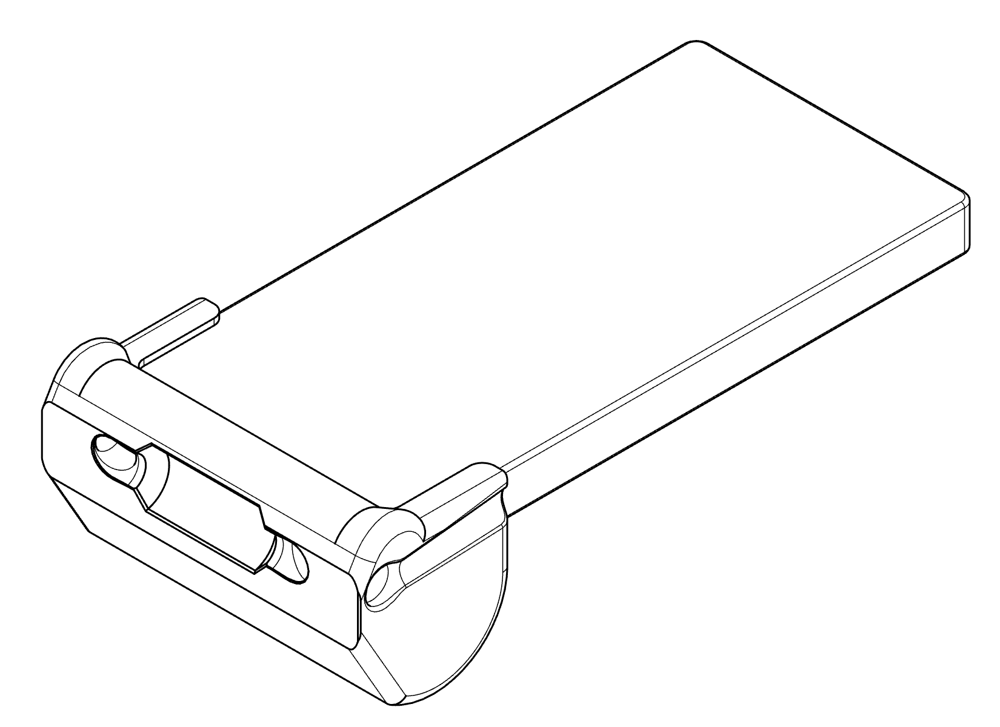

# Leashy - Tools for Jerk Free Photography
Leashy is a _useful_ phone retention system that is designed to quickly slip over your phone (and it's case) and tether it to your person.

> Note We're still in the design phase, and are actively building phone gauges and soliciting measurements.

## How it works
Leashy is a 3D printed frame (and optional grip) that allows you to easily loop a retaining cord around your phone; holding it in such a way that the loop will not slip off or release when sharply tugged.

## Using your Leashy
- Setting Up
  - Insert your phone (case on) with the Camera side furthest from the base and the screen facing the access cutout.
  - Loop the retaining cord over the top of the phone so that the forward side of the cord is on away from the camera.
  - Snug the friction knot at the base of your Leashy until the retaining cord is as tight as possible.
  - Optionally add a stopper bead or tie a stop knot
- Taking Off
  - Remove the stopper bead or stop knot if present
  - Gently pull at the release line until there is enough slack to remove your phone.

## Selecting your Leashy
- Browse the types of Leashy available in the [types](types/) directory.
- Determine the `gauge size` of your phone and case combination using the tools in the [gauges](gauges/) directory.
- Compatible models can be found in the [models](models/) directory in a subdirectory corresponding to your `gauge size`. 
- If you cannot locate your exact gauge size, you can
  - Try closet _larger_ gauge size directory, with preference given to the smaller gauge tightness.
  - Message the maintainers and we will gladly add new models for you.
- Leashy Models are named as
  - `{model type}_{gauge size}_{special letters}` ex: `dslr_948-7550_t.stl` or `minimal_1010-8011_mg.stl`
    - Special letters
      - `m` average phone height (&gt;125mm and &#x22DC; 150mm)
      - `s` short phone height (&#x22DC; 125mm)
      - `l` long phone height (&gt;150mm)
      - `n` normal orientation
      - `g` reversed (goofy)
- If you don't see the model you require, don't hesitate to ask.

### Types of Leashy
Right now we offer three models [base](types/base/) intended for remixing, [dslr](types/dslr/) which mimics a DSLR grip in an ambidexterous way. and `minimal`. DSLR is intended to mimic the side grip of a mid-size mirror-less camera in an ambidextrous way.  Basic is simply the absolute minimum required to retain the phone.

## Gauges and Sizes
Your phone's size is probably well known, but a lot of other things aren't... like case size and fitment, printer parameters, slicer settings, etc.

The gauge size is a measurement that allows a person to easily obtain a set of _magic numbers_ that _just work_ as long as they are printed by the same printer with the same settings as will be used for the Leashy.

### Finding your Gauge Set
Gauges may be found under the [gauges](gauges/) directory, and are further divided into two types [simple gauges](gauges/simple/) intended for measuring phones that do not have obtainable specifications, and [combination gauges](gauges/combination/) built to measure a known phone model.  If you cannot find a combination gauge set but can provide measurements, the maintainers will gladly add it for you.  The simple set of gauges are intended for advanced use.

Combination gauges are organized into subdirectories by brand, model, and (optionally) year, for example [gauges/combination/iphone/17 pro max](gauges/combination/iphone/17%20pro%20max/) contains the combination gauges to measure your **iPhone 17 Pro Max** and it's case.

### Using a Combination Gauge
A combination gauge will have three important pieces of information: the small measurement label, a set name in brackets, and the large measurement label.

The measurement label contains two parts separated by a '/'; The base number on the left, and the increment number on the right.

A gauge measurement can be read by placing the phone and case into the gauge, with the flat side of the gauge opening being adjacent and parallel to the case, noting which step blocks the phone from reaching the bottom.  If no steps block the phone and case then the gauge number for that measurement is simply the base number.  For each step between the phone and the baseline add the increment number to the base.

For example, if I insert my 2024 Stylus and case into the 1250/100 gauge, it stops on the second step from the bottom, the gauge number would be 1450 (1250 + 2*100)

Each Combination set has 4 or 8 gauges of in steps of 25 gauge units; and you should use the gauge measurement that most snugly (without squeezing) fits your phone and case